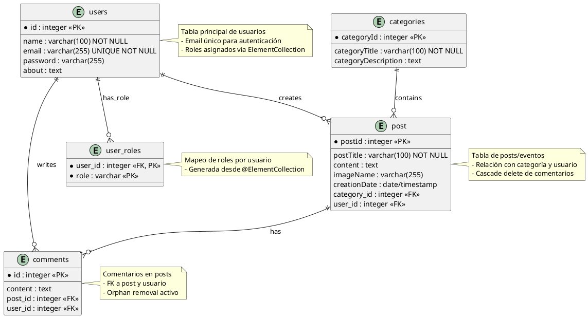

## Modelo Entidad-Relación (MER) - ViveMedellin Backend

Este documento describe el MER refinado a partir de las entidades JPA encontradas en `com.vivemedellin.models`.

Resumen de entidades principales (mapadas en el código):

- User (users)
  - PK: id (integer)
  - Atributos: name, email (unique), password, about
  - Relaciones: 1 User -> N Post, 1 User -> N Comment, 1 User -> N Role (via user_roles)

- Role (elemento enumerado)
  - Valores: ROLE_USER, ROLE_ADMIN
  - Implementación en BD: tabla auxiliar `user_roles(user_id, role)` con PK compuesta
  - Mapeado como `@ElementCollection` en `User`

- Category (categories)
  - PK: categoryId (integer)
  - Atributos: categoryTitle, categoryDescription
  - Relaciones: 1 Category -> N Post

- Post (post)
  - PK: postId (integer)
  - Atributos: postTitle, content, imageName, creationDate
  - FK: category_id, user_id
  - Relaciones: N Post -> 1 Category, N Post -> 1 User, 1 Post -> N Comment

- Comment (comments)
  - PK: id (integer)
  - Atributos: content
  - FK: post_id, user_id
  - Relaciones: N Comment -> 1 Post, N Comment -> 1 User

Cardinalidades (resumen):
- User 1---* Post
- User 1---* Comment
- Category 1---* Post
- Post 1---* Comment

Notas sobre mapeo JPA detectado:
- `User.roles` está modelado como `@ElementCollection` de `Enum Role` (se generará una tabla auxiliar `user_roles` con columna `role` tipo TEXT/ENUM).
- Las relaciones usan `@ManyToOne` y `@OneToMany` con `CascadeType.ALL` en algunos casos (p. ej. eliminar un `Post` liberará `Comment` por `orphanRemoval=true`).

PlantUML (texto) — puede pegarse en un editor PlantUML para generar el diagrama gráfico:

